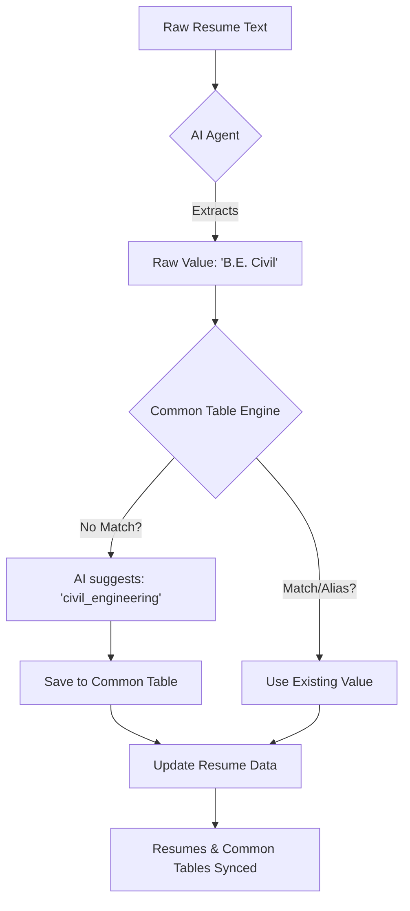
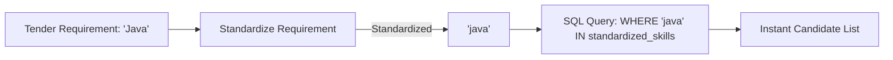

# Common Table System Explanation

This document explains the architecture and logic behind the "Common Table" resolution system used in the Resume-Tender Matching system.

## 1. Extraction Phase (Standardization)

During the resume parsing stage, the system doesn't just store raw text. It maps skills and education to canonical IDs.

### If NO match is found:
1.  **AI Suggestion**: The AI suggests a "normalized" version of the raw value (e.g., `btech_civil`).
2.  **Creation**: This new value is added to the `CommonSkill` or `CommonEducation` table so future resumes can match it.
3.  **Persistence**: The `Resume` record stores this same normalized value in its `standardized_skills` or `standardized_education` column for retrieval.

### Why this matters:
- **Consistency**: "ReactJS", "React.js", and "React" all become `react_js`.
- **Searchability**: The system knows that "B.E. Civil" and "Bachelor of Engineering (Civil)" are the same entity.

---

## 2. Retrieval/Matching Phase (Precision)

During matching, instead of doing a slow "fuzzy" search on millions of resumes, the system uses the standardized IDs for instant SQL filtering.

### Key Benefits:
1.  **High Precision**: No false positives from similar-sounding words.
2.  **Speed**: SQL filtering on indexed columns is lightning fast compared to LLM-based RAG.
3.  **Scalability**: Works efficiently even with thousands of resumes.

---

## 3. How the AI helps (The Resolution Engine)

In `extraction_agent.py`, the AI is given the "Master Data Context" (current list of common skills).
- If it sees a skill it knows, it picks the existing name.
- If it's a new variation of an existing skill, it adds it as an **alias**.
- If it's entirely new, it creates a **new common entry**.

This way, the system "learns" and gets smarter with every resume processed.
